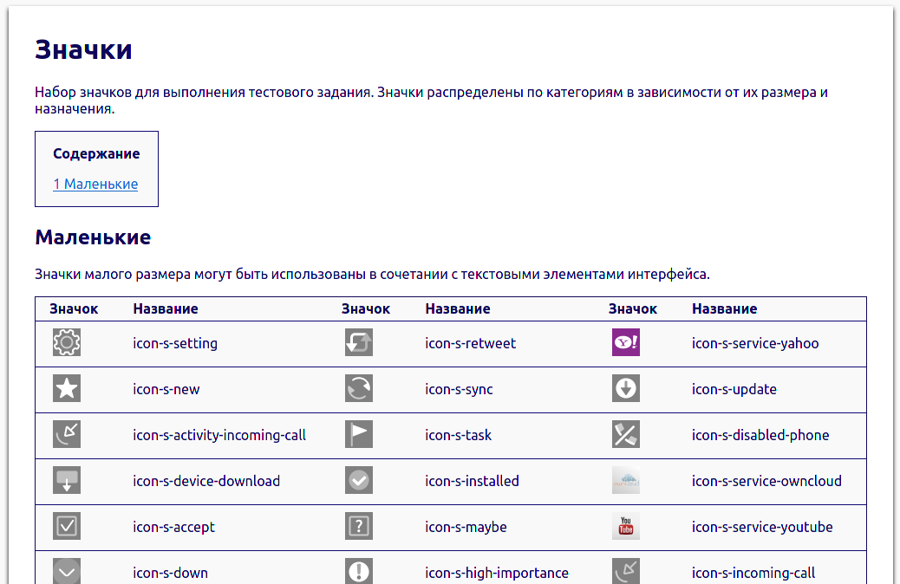

# icon-reference-script
This program will generate an icon reference page similar to [Sailfish Icon Reference](https://sailfishos.org/develop/docs/jolla-ambient/) based on a given HTML template.  
`template.html` provides a template example.

## Usage:
`python generate.py path_to_icons path_to_template target [--small] [--medium] [--large] [--cover]`

### Arguments:

- `path_to_icons`: 	folder containing icons to be listed in the reference page
- `path_to_template`: file containing HTML template
- `target`: file to place output in

### Optional:

- `--small`: generate reference for icons whose filename is prefixed with `icon-s`
- `--medium`: generate reference for icons whose filename is prefixed with `icon-m`
- `--large`: generate reference for icons whose filename is prefixed with `icon-l`
- `--cover`: generate reference for icons whose filename is prefixed with `icon-cover`

If no optional argument is given, the program will attempt to generate reference for all present icons.